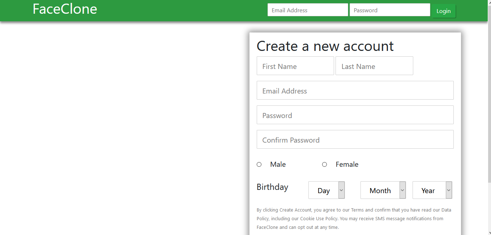
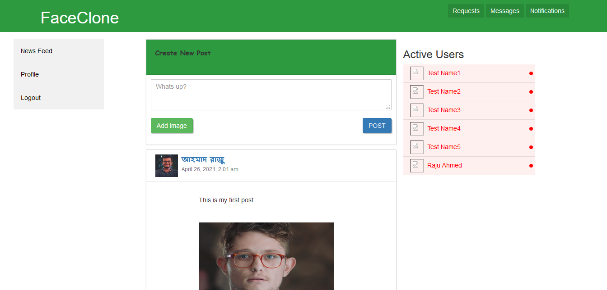
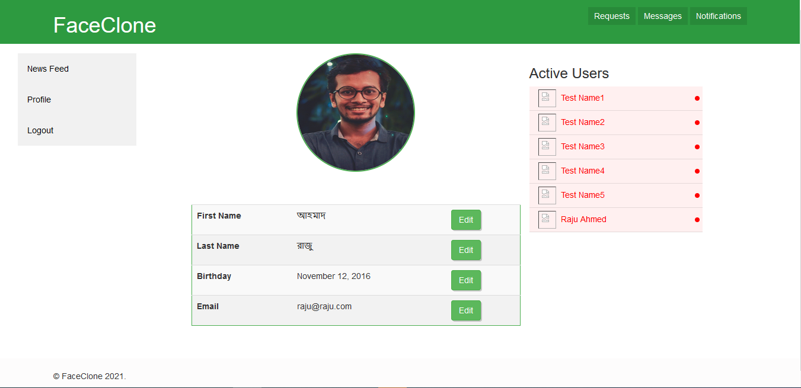

This is a social media project(Facebook Clone).

<strong><i>Dependency-</i></strong>

PHP version: 7.3.22, 
mysql version: 15.1, 
laravel version: 8.12.

<strong><i>Run the project-</i></strong>

Download the project. If you are using Xampp copy the project inside your htdocs folder. Provide db connection. My database can be found in "project/database/database.sql" file. Import the database and  run a composer update inside your project folder by executing following command-

<b>"composer update"</b>

If everything is done properly you will find the project running successfully. In case of any problems feel free to contact me at <b><i>"rajuahmad6789@gmail.com"</b></i>  Here I have attached some screenshots from my project.

<strong><i>Screenshots-</i></strong>

      

      

    

